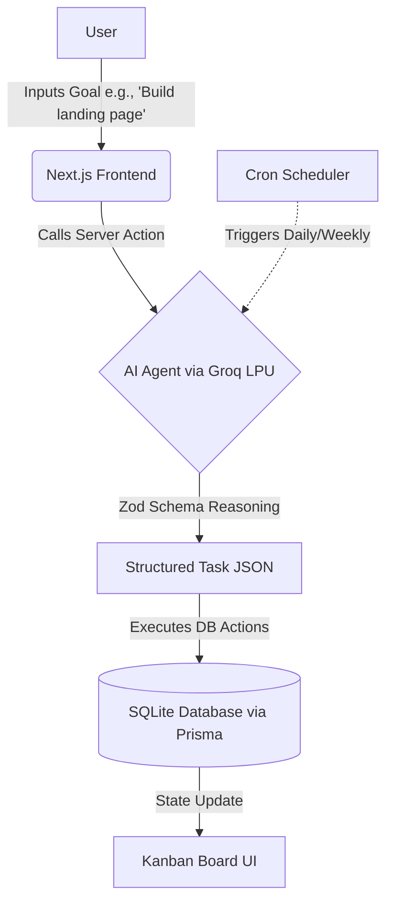

# Task Pilot - AI-Powered Task Management 🚀

🔗 **Live Demo:** [https://task-pilot-93yl.onrender.com](https://task-pilot-93yl.onrender.com)

## 📌 Problem/Task Chosen
We chose to build an **Agent capable of Reasoning, Planning, and Execution**. The challenge was to create an AI that can maintain state and context across a workflow. Task Pilot solves this by acting as an autonomous Project Manager—taking high-level user goals, reasoning about the required steps, and automatically executing database actions to generate prioritized Kanban tasks.

## 🏗️ System Architecture & Workflow Diagram



## 🎯 Sample Input / Output

**User Input (Goal):** 
> "Set up authentication for my Next.js app"

**AI Agent Output (Executed directly into Kanban Board):**
1. **Task:** "Install NextAuth & Prisma Adapter" *(Priority: HIGH)*
2. **Task:** "Configure Credentials Provider" *(Priority: HIGH)*
3. **Task:** "Create Login/Register UI pages" *(Priority: MEDIUM)*
4. **Task:** "Protect Dashboard Routes with Middleware" *(Priority: LOW)*

## 🚀 Setup/Run Instructions

1. **Clone the repository and install dependencies:**
   ```bash
   npm install
   ```

2. **Set up Environment Variables (`.env`):**
   ```env
   DATABASE_URL="file:./dev.db"
   NEXTAUTH_SECRET="your-super-secret-key-here"
   NEXTAUTH_URL="http://localhost:3000"
   GROQ_API_KEY="your-groq-api-key"
   ```

3. **Initialize the Database:**
   ```bash
   npx prisma generate
   npx prisma db push
   npx prisma db seed
   ```

4. **Run the Development Server:**
   ```bash
   npm run dev
   ```
   Open [http://localhost:3000](http://localhost:3000) in your browser.
   *Login with the seeded admin account:*
   - **Email**: `admin@detask.com`
   - **Password**: `password123`

## 💻 Tech Stack
- **Frontend**: Next.js 14, Tailwind CSS, DnD-Kit
- **Backend & DB**: Next.js Server Actions, Prisma ORM, SQLite
- **AI Integration**: Vercel AI SDK, Groq API (`qwen-2.5-32b`)

---
**Made by Bishnu Kumar Sardar**  
*Full Stack Developer* | Cambridge Institute of Technology  
